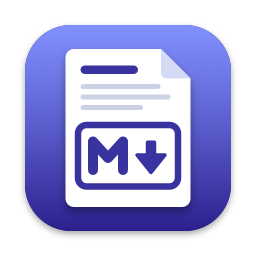
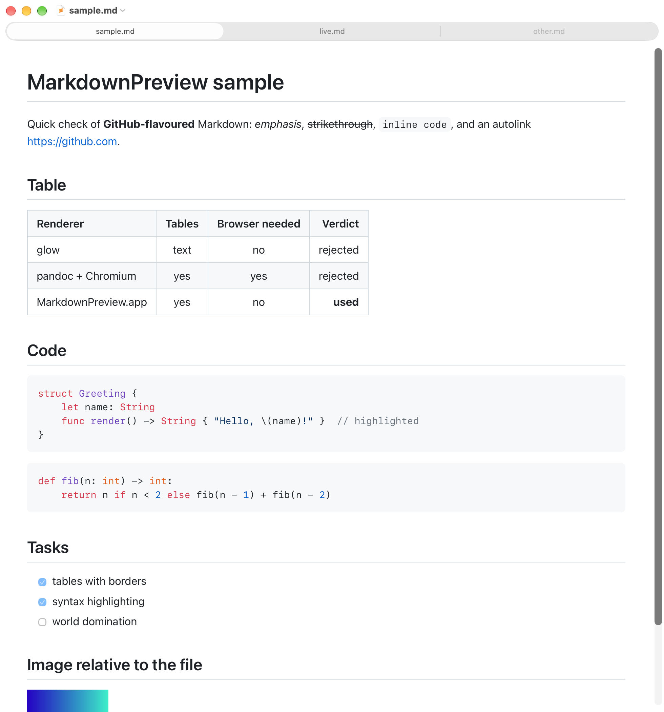

# MarkdownPreview

Native macOS Markdown viewer plus a Quick Look extension, both backed by one renderer.

- GitHub-flavoured Markdown: bordered tables, fenced code with syntax highlighting, task lists, strikethrough, autolinks, heading anchors.
- Images relative to the file are inlined; follows system light/dark mode; no network needed for rendering.
- Live reload on save (also atomic saves), scroll position kept. Links open in the default browser only when clicked; relative `.md` links open in the app.
- `open -a MarkdownPreview file.md` on an already open file focuses its window.
- Zoom with ⌘ or ⌃ and `+`/`=` / `-`/`_` (Shift optional), reset with ⌘0; shared by all windows and remembered.
- Floating **Edit** button (⌘E) opens the file in Sublime Text (falls back to VS Code, then TextEdit;
  override with `defaults write com.pannous.MarkdownPreview editorBundleIdentifier <bundle id>`).
- Finder space bar and Spotlight show the same rendering through the embedded Quick Look extension.



## Build & install

```sh
./install.sh   # xcodegen + xcodebuild, installs ~/Applications/MarkdownPreview.app, registers app and extension
probes/test.sh      # headless checks: renderer output, extension registration
UI=1 probes/test.sh # plus window checks (brings windows to front); writes probes/quicklook.png, probes/app_window.png
```

Needs Xcode and XcodeGen (`brew install xcodegen`). Signing uses the local "Apple Development" identity; override with `SIGN_IDENTITY=-` for ad hoc, and set your own `DEVELOPMENT_TEAM` in `project.yml`.

## Layout

| Path | What |
|------|------|
| `Renderer/` | `MarkdownRenderer.framework`: marked + highlight.js run in JavaScriptCore, CSS, HTML page template |
| `App/` | SwiftUI `DocumentGroup` viewer, `WKWebView`, file watcher |
| `QuickLook/` | data-based Quick Look preview extension returning the rendered HTML |
| `Icon/make_icon.swift` | draws the app icon into `App/Assets.xcassets` (`xcrun swift Icon/make_icon.swift`) |
| `probes/` | sample files and test script |
| `notes/` | tricky parts (signing, Quick Look, sandbox, testing) |
