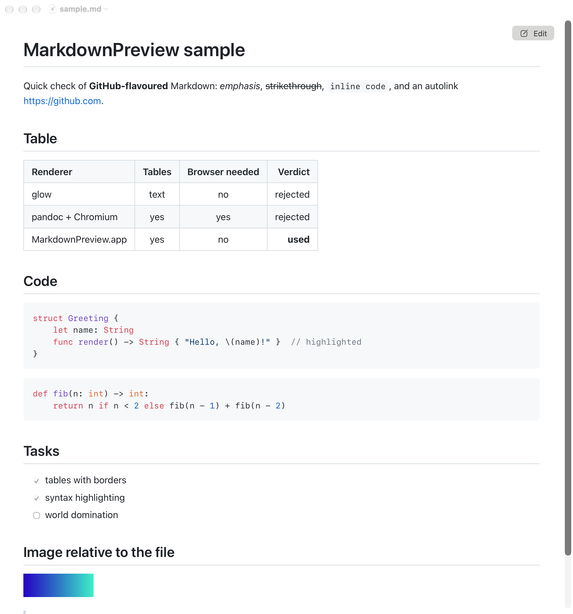

# MarkdownPreview

Native macOS Markdown viewer plus a Quick Look extension, both backed by one renderer.

- GitHub-flavoured Markdown: bordered tables, fenced code with syntax highlighting, task lists, strikethrough, autolinks, heading anchors.
- Images relative to the file are inlined; follows system light/dark mode; no network needed for rendering.
- Live reload on save (also atomic saves), scroll position kept. Links open in the default browser only when clicked; relative `.md` links open in the app.
  `[[page]]` wiki links: a page not next to the file is searched in its folder tree like Sublime's MarkdownEditing
  (any case, space/dash/underscore alike); a page found nowhere opens as a new, unsaved file in Sublime Text or VS Code
  (their command line tool; other editors get the file created with a `# page` title).
- Previous / next tab with ← / → (⌘ optional), ⌘[ / ⌘] or the mouse's back / forward buttons (SteerMouse sends ⌘[ / ⌘]),
  like a browser's back and forward;
  with a single tab the arrows scroll as usual.
- One instance and one window only, everything in tabs: files and `.md` links open as a new tab of the window (whatever the system tab
  setting, also when opened in the background or restored at launch); a second copy of the app (`open -n`, another build) hands its files to the running one and quits.
  `open -a MarkdownPreview file.md` on an already open file selects its tab.
- Zoom with ⌘ or ⌃ and `+`/`=` / `-`/`_` (Shift optional), reset with ⌘0; shared by all windows and remembered.
- Collapse sections level by level with ⌃[ (deepest open level first), expand with ⌃]; click a heading to fold just it. Folds survive live reload.
- Floating **Fix** button (⌘⇧L) left of Edit: adds two trailing spaces to every line followed by another text line (headings excepted), so each newline
  shows as a line break instead of being joined into the paragraph. Fenced code is left alone; a file with nothing to fix just beeps.
- Collapsible **Contents** panel at the right edge below Edit: jump to any heading, revealing folded sections automatically. Escape closes the panel. Updates on live reload.
- Floating **Edit** button (⌘E) opens the file in Sublime Text (falls back to VS Code, then TextEdit;
  override with `defaults write com.pannous.MarkdownPreview editorBundleIdentifier <bundle id>`).
- **Uniscript** in files that start with `<:`: `<:alpha> <:fracture A> \:infinity` shows as α 𝔄 ∞ (prose only, never in code spans or blocks);
  an unknown entity stays visible with a red wavy underline, a character without a counterpart (`<:greek c>`) stays plain
  with an amber dotted underline; the message is the tooltip. Converter: the Swift package of
  [pannous/uniscript](https://github.com/pannous/uniscript). Samples: `probes/uniscript/`.
- Fast startup: restored tabs render only when first selected; which installed font draws a rare character is cached in
  `~/Library/Caches/com.pannous.MarkdownPreview/user-fonts.json` until fonts change (`probes/startup_timing file.md` shows the stages).
- Finder space bar and Spotlight show the same rendering through the embedded Quick Look extension.



## Build & install

```sh
./install.sh   # xcodegen + xcodebuild, installs /Applications/MarkdownPreview.app, registers app and extension
probes/test.sh      # headless checks: renderer output, extension registration
xcrun swiftc -parse-as-library probes/table_of_contents.swift -F build/Build/Products/Release -Xlinker -rpath -Xlinker "$PWD/build/Build/Products/Release" -o probes/table_of_contents
probes/table_of_contents # offscreen Contents navigation and live-reload checks
xcrun swiftc -parse-as-library probes/contents_dismissal.swift -F build/Build/Products/Release -Xlinker -rpath -Xlinker "$PWD/build/Build/Products/Release" -o probes/contents_dismissal
probes/contents_dismissal # offscreen Escape, focus, and right-edge positioning checks
UI=1 probes/test.sh # plus window checks (brings windows to front); writes probes/quicklook.png, probes/app_window.png
```

Needs Xcode and XcodeGen (`brew install xcodegen`). Signing uses the local "Apple Development" identity; override with `SIGN_IDENTITY=-` for ad hoc, and set your own `DEVELOPMENT_TEAM` in `project.yml`.

## Layout

| Path | What |
|------|------|
| `Renderer/` | `MarkdownRenderer.framework`: marked + highlight.js run in JavaScriptCore, CSS, HTML page template |
| `App/` | SwiftUI `DocumentGroup` viewer, `WKWebView`, file watcher |
| `QuickLook/` | data-based Quick Look preview extension returning the rendered HTML |
| `Icon/make_icon.swift` | draws the app icon into `App/Assets.xcassets` (`xcrun swift Icon/make_icon.swift`) |
| `probes/` | sample files and test script |
| `notes/` | tricky parts (signing, Quick Look, sandbox, testing) |
